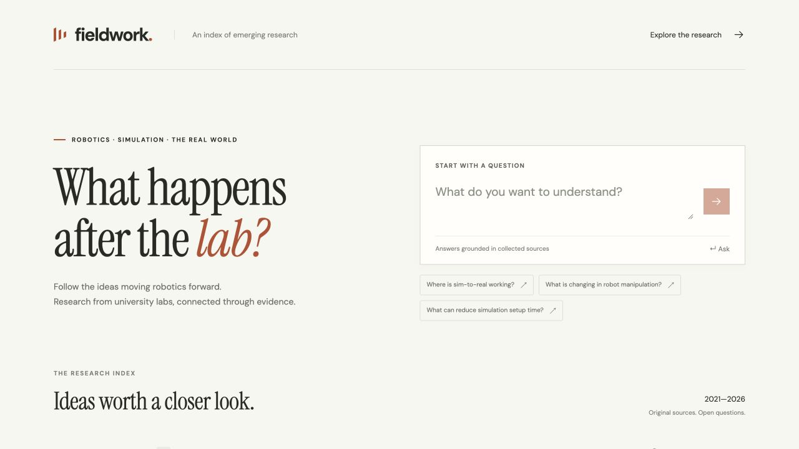
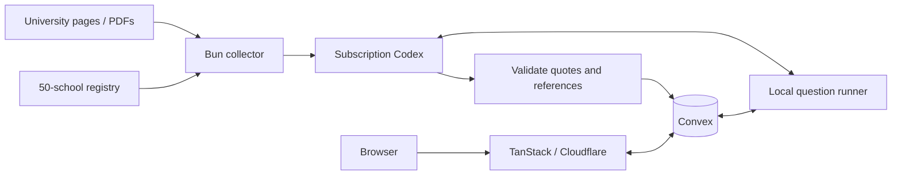

# Fieldwork

Campus robotics research, connected through evidence.

University demos are scattered across lab pages, showcases and papers. Fieldwork turns them into searchable evidence and testable product hypotheses.

[Live demo](https://antifund-researcher.service-fff.workers.dev) · [Source provenance](docs/SOURCES.md) · [Collection pipeline](docs/PIPELINE.md)

Ask a question, explore a research signal, or open a project. Every answer links to saved quotations and original sources. Project notes separate reported results from interpretation and limitations.



## Stack

- **Bun + TypeScript** for the app and collection commands.
- **TanStack Start / Query + React** for the interface and server routes.
- **Cloudflare Workers** hosts the app; **Convex** stores research and question jobs.
- **Codex CLI** uses the operator's ChatGPT subscription for discovery, extraction, synthesis and answers. No paid model API.
- **Poppler + Tesseract** expose PDF text, page numbers and scanned pages locally.



## Run locally

Requires Bun, Node 22+, a subscription-authenticated Codex account, Cloudflare and Convex accounts. Install `poppler` and `tesseract` for PDF collection (`brew install poppler tesseract` on macOS).

```sh
bun install
bunx codex login
bunx convex dev --once
```

Keep the deployment settings generated in `.env.local`. Add `CONVEX_URL` and a random `RESEARCH_WRITE_SECRET` there. Put those same two values in `.dev.vars` for the local Cloudflare runtime. Set the secret in the Convex dashboard's environment variables. Do not prefix secrets with `VITE_`.

```sh
bun run research:seed
bun run research:worker  # leave running in one terminal
bun run dev              # another terminal: http://127.0.0.1:3000
```

`bun run` puts the pinned Codex executable on PATH. For direct `bun scripts/research.ts` calls, set `RESEARCH_CODEX_COMMAND` to its absolute path if your global CLI is older. The default model is `gpt-6.1-sol`, medium reasoning.

## Collect research

```sh
bun run research discover oxford --collect
bun run research discover-batch 2
bun run research extract mit https://news.mit.edu/2024/can-robots-learn-machine-dreams-1119
bun run research synthesize
bun run research status
```

The registry contains 50 institutions, with a 2021–2026 collection window. The checked-in corpus has **26 projects across ten schools** and is a **partial collection**, not all work from those institutions. Discovery is bounded to six sources per school per run; batches cover up to five schools without collected projects. Downloads are cached and records use stable IDs. Full-text extraction is limited to the first 140,000 characters. [Read the provenance and selection limitations](docs/SOURCES.md).

## Deploy

```sh
bunx convex deploy
# Set RESEARCH_WRITE_SECRET in the production Convex environment.
bun run deploy
bunx wrangler secret put CONVEX_URL
bunx wrangler secret put RESEARCH_WRITE_SECRET
CONVEX_URL=https://YOUR-PRODUCTION.convex.cloud bun run research:seed
CONVEX_URL=https://YOUR-PRODUCTION.convex.cloud bun run research:worker
```

Use the same capability across the server, Convex and the runner. The deployment URL is public; the capability is private. The public app remains browsable when the runner is offline, but new questions require it to be awake and running. Cloudflare does not run the subscription-backed Codex process.

Questions are limited to five per visitor/hour, 100 total/day and 20 pending jobs. Answers use a bounded subset of the corpus, so absence from an answer is not proof that research does not exist. Market gaps are hypotheses; this corpus cannot establish market size, buyer demand or commercial viability on its own.

## Verify

```sh
bun run typecheck
bun test
bun run build
```

See [implementation plan](docs/PLAN.md) and [validation record](docs/VALIDATION.md). Source content belongs to its original authors; this repository stores selected excerpts and research notes, not full PDFs.
