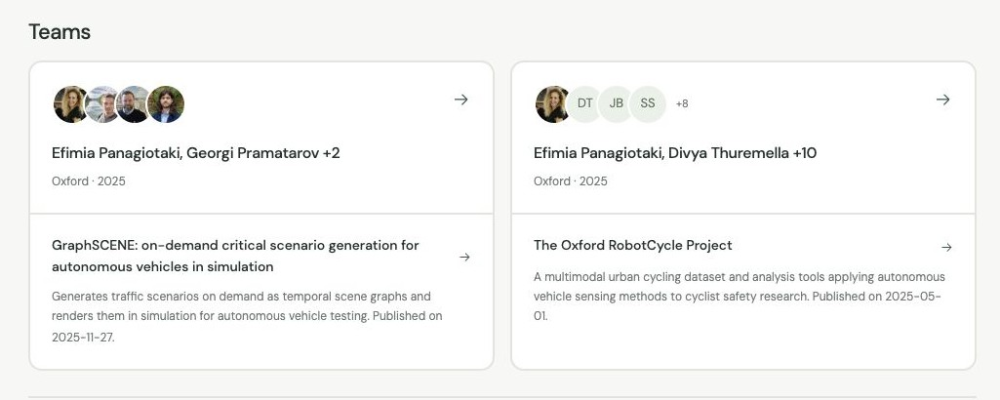

# Fieldwork

Market ideas from university projects, with evidence behind each one.

[Live app](https://antifund-researcher.service-fff.workers.dev) · [Signal model](docs/SIGNALS.md) · [Intake pipeline](docs/INTAKE.md) · [Teams](docs/TEAMS.md)

The app opens with five signal cards. Selecting one moves them into a fixed desktop rail and opens its report: a concise description, sourced market context, potential customers and applications, followed by Teams. Each team card shows its people first, school and years second, and its projects and papers underneath. Clicking the team opens verified portraits, bios and profile links; clicking its research opens the original evidence. Sources and unanswered questions unfold on demand. Mobile uses compact breadcrumbs.

The checked-in starting corpus is **26 projects from ten schools, dated 2021–2026**. Five briefs interpret that research. The active **2025–2026 intake** collects complete identified showcase galleries across Georgia Tech, Berkeley, Waterloo, MIT and Stanford. The broader 50-school archive is deferred. The registry is planned coverage; neither a completed search nor a successful download establishes exhaustive collection.



## Stack

Bun + TypeScript; TanStack Start/Query + React; Cloudflare Workers; Convex. Subscription-authenticated Codex CLI handles discovery, classification, signal synthesis and market research locally. Poppler extracts PDF text and page references. No paid model API, scraping service or graph database.

## Run

Requires Bun, Node 22+, Codex subscription authentication, Convex and Cloudflare accounts. Install Poppler for PDFs (`brew install poppler` on macOS).

```sh
bun install
bunx codex login
bunx convex dev --once
```

Keep generated deployment settings in ignored `.env.local`. Add `CONVEX_URL` and a random `RESEARCH_WRITE_SECRET`; set the same secret in Convex. Put these server values in ignored `.dev.vars` for Workers emulation. Never prefix a secret with `VITE_`.

```sh
bun run research:seed
bun run dev
```

Local development uses TanStack's native server to avoid local Workers IPv6 stalls. `bun run dev:workers` tests Workers emulation; production builds use Workers. Collection uses the pinned Codex CLI, `gpt-6.1-sol` and medium reasoning.

## Collect and derive

Run four workers together: collection, classification, grouping, and signal analysis with market research. Each gets an isolated snapshot; one coordinator merges checkpoints and mirrors metadata to Convex. The default run lasts two hours and can resume from its saved archive.

```sh
bun run research:pipeline run --depth 5
bun run research:pipeline status
bun run research:pipeline stop
```

[Worker handoffs and operations](docs/PIPELINE.md). Publication follows evidence inspection; pipeline output is not automatically presented as a verified market signal.

Individual stages remain available:

```sh
bun run research:scan                         # three archive searches per school; resumes
bun run research:intake collect --budget 100 --minutes 30
bun run research:intake classify --budget 20 --minutes 30
bun run research:intake graph
bun run research:signals group --budget 3       # related buyer problems beyond keyword matches
bun run research:signals derive --budget 3
bun run research:signals market --budget 3
bun run research:signals prepare
bun run research:seed .research-cache/intake/publication.json
bun run research:intake status
```

Repeat bounded collection and classification commands to resume. Add `--retry` to bypass failure backoff. All discoveries, raw revisions, complete extracted text and classification responses stay under ignored `.research-cache/intake`. Changed content is preserved as a new revision. Convex mirrors immutable metadata and job coverage; full raw downloads stay local.

Classification comes before grouping or commercial selection. Unknown dates, ambiguous projects, failed parsers and isolated graph nodes remain in the archive. Publishing requires exact source evidence and verified 2025–2026 dates. Market research uses independent primary sources and verifies short excerpts against downloaded pages. It establishes context, not demand or willingness to pay.

JavaScript-only galleries, scanned PDFs, unavailable pages and incomplete search remain collection gaps. [Operational details and limits](docs/INTAKE.md).

## People

```sh
bun run research:people             # enrich the starting corpus from verified profiles
bun run research:people --publish   # enrich live Convex records; preserve later collection
```

Profiles match exact credited authors within verified projects. Missing portraits or social links remain absent; every credited contributor still appears. [Profile provenance and publication](docs/TEAMS.md).

## Deploy and verify

```sh
bun run typecheck
bun test
bun run build
bunx convex deploy --yes
bun run deploy
```

Configure `CONVEX_URL` and `RESEARCH_WRITE_SECRET` as Worker secrets and set the matching capability in production Convex. Seed the production deployment with its `CONVEX_URL`. Codex runs on the operator's computer; it is not hosted by Cloudflare.

Never commit credentials, raw downloads or local logs. Original source material belongs to its authors; this repository contains selected excerpts and research notes.

Active collection: `bun --env-file=.env.local run research:showcases` runs collection, every-record analysis and private signal extraction for the five-school 2025–2026 scope. See [the pipeline guide](docs/PIPELINE.md). Broad intake is deferred and its archive is preserved.
